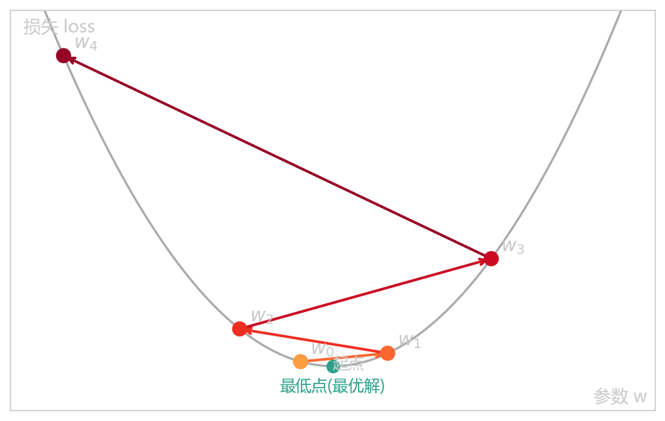
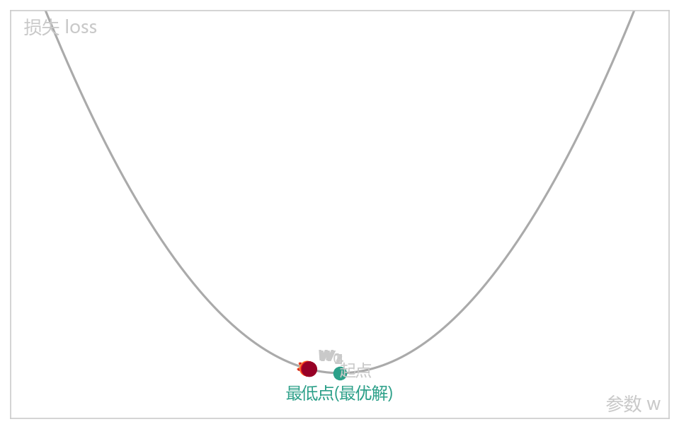

+++
title = "深度学习：从抽象到具体 (1)"
data = 2026-06-04
tags = ["DeepLearning"]
+++

在正文开始之前我想先谈一谈我对神经网络的感受——抽象。虽然我对于AI工具有不少的使用经验，但对于神经网络如何运作可以说非常模糊，最开始接触的时候不理解网络是怎么推理、训练以及理解我提出的问题。相信不少人和我有一样的困惑，如果你和我一样不想局限在使用工具而是想知道背后的原理，这篇文章或许可以给你点启发。

# 1. 初识函数的自学习
只要是接触神经网络训练的人都离不开那个经典的例子：`y = w * x + b`，可以说这是所有复杂函数的鼻祖。所有训练模型过程无非就是给你训练资料 -> 将资料拆成 "训练集" + "验证集" -> "训练集"用于微调函数的参数得到"微调模型" -> 测试"微调模型"在验证集上测试正确率 -> 应用在真实数据上看模型的推理结果。当然中间会出现各种各样的问题，比如过拟合、梯度消失/爆炸、虚假相关等问题，不过这是一个循序渐进的过程，在这里我们暂且不论。
## 1.1. 从零训练
先简单直观的从零搭建一条"神经网络"，第一步我们先"获取"一批数据（假设我们的目的函数为y = 2 * x + 1
```python
import numpy as np
# 造一批数据(1000组)：真实关系 y = 2 * x + 1
np.random.seed(0)
x = np.random.rand(1000)
y = 2 * x + 1
```
获取完数据后，我们简单初始化一下参数
```python
w, b = 0.0, 0.0
lr = 0.1        # 学习率
epochs = 600    # 训练轮次
```
接下来我们就可以写一个训练过程了
```python
n = len(x)
for epoch in range(epochs):
    y_pred = w * x + b                          # 向前预测
    loss = ((y_pred - y) ** 2).mean()           # 计算平均损失
    dw = (2 / n) * ((y_pred - y) * x).sum()     # 反向传播，w的梯度
    db = (2 / n) * (y_pred -y).sum()            # 反向传播，b的梯度
    w -= lr * dw                                # 更新参数w
    b -= lr * db                                # 更新参数b
    if epoch % 100 == 0:
        print(f"epoch {epoch:3d} | loss={loss:.4f} | w={w:.3f} | b={b:.3f})
print(f"\n训练完成: w={w:.3f}, b={b:.3f} (真实值 w=2, b=1)")

# 输出结果样例如下:
"""
epoch   0 | loss=4.3052 | w=0.231 | b=0.398
epoch 100 | loss=0.0076 | w=1.706 | b=1.156
epoch 200 | loss=0.0005 | w=1.923 | b=1.041
epoch 300 | loss=0.0000 | w=1.980 | b=1.011
epoch 400 | loss=0.0000 | w=1.995 | b=1.003
epoch 500 | loss=0.0000 | w=1.999 | b=1.001

训练完成: w=2.000, b=1.000 (真实值 w=2, b=1)
"""
```

这样我们就成功训练了一个模型 y=2x+1

## 1.2. 学习率
学习率：可以将模型训练的过程想象成一个人从山顶往最低点(loss最低)走，而学习率则是这个人每次迈的步伐大小。
- 学习率过大，容易在最优点来回"跳跃"甚至越过它，导致****。极端情况下参数更新会不断放大，损失值发散到无穷大，出现 NaN 或 Inf(数值溢出)，训练直接崩溃



之所以会出现损失越来越大是因为关键在于一个正反馈循环：学习率 η 是常数，但每次更新的"步子"大小 = η × 当前梯度。当步子太大、越过了最低点，落点会比上一次离最低点更远；而离最低点越远，那里的梯度就越大；η 乘以更大的梯度，就迈出更大的一步，于是下一次越过得更远...如此循环，参数在最低点两侧来回横跳，且摆幅一次比一次大，损失自然越垒越高

- 学习率过小，每一步更新都很微小，****，需要大量时间和迭代才能接近最优，造成计算资源严重浪费。同时，小步长容易缺乏"动能"，容易卡在局部最小值或鞍点附近出不来，也可能在达到理想解之前就因为达到训练轮数上限而提前终止，导致欠拟合




## 1.3. 梯度

对只有一个参数的函数，梯度其实就是我们高中学的****：它告诉你函数在这一点有多陡、朝哪个方向升。当函数有多个参数(比如我们的 w 和 b)，梯度就是把每个参数各自的斜率打包成一个向量——也就是 `dw` 和 `db` 合在一起，`(dw, db)`。

梯度有一个关键性质：****。注意是"上升"，可我们要的是让 loss 下降，所以训练时要朝****——这正是 1.1 代码里 `w -= lr * dw` 那个**减号**的来历：沿梯度反方向迈一步，就是往 loss 更低的地方走。这也呼应了 1.2 那个下山的比喻：梯度告诉你"哪个方向是上坡、坡有多陡"，只要每次都朝下坡迈步，就能慢慢走到谷底。

梯度的**大小**也有讲究，它代表"有多陡"。坡越陡，梯度越大，在学习率固定的情况下，迈出的步子(lr * 梯度)就越大；越接近谷底，坡越平，梯度越小，步子自动变小，于是越靠近最优解走得越稳、越慢——这是好事，意味着它会自然收敛下来。回头看 1.2 学习率过大那张图就更清楚了：落点离谷底越远的地方坡越陡、梯度越大，如果 lr 又太大，这一步就甩得更远，越甩越陡、越陡越远，正反馈把 loss 越垒越高。

最后一个要点：梯度等于 0，意味着这里是一块"平地"。平地可能是我们想要的****，但也可能是 1.2 提过的****——那些地方梯度同样接近 0，会让参数误以为"到底了"而停下不动。这就是为什么小学习率容易卡住：步子太小、没有"动能"，一旦掉进这种平地就爬不出来了。


## 1.4. 反向传播
回到 1.1 的训练代码，注意到中间有这么两行：

```python
dw = (2 / n) * ((y_pred - y) * x).sum()     # 反向传播，w的梯度
db = (2 / n) * (y_pred - y).sum()           # 反向传播，b的梯度
```

这两行就是反向传播的全部.

一次训练可以拆成"一来一回"两个方向。****是"来"：数据从输入出发，经过 `y_pred = w * x + b` 算出预测，再算出 loss——信息顺着箭头一路往前流到终点(loss)。问题是：loss 很大，但到底该怪谁？是 w 没调好，还是 b 没调好？每个参数又该往哪个方向、动多少才能让 loss 变小？****就是"回"：从终点 loss 出发，反着走回去，给每一个参数算一笔账——"这个参数稍微动一点点，loss 会跟着变多少"。这个"变多少"就是该参数的****。"反向"二字就是这么来的：责任是从 loss 倒推回每个参数的。

那具体怎么倒推？靠的是****。loss 不是直接由 w 决定的，中间隔了一层 y_pred：`w → y_pred → loss`。所以 w 对 loss 的影响，等于把这条链路上每一段的影响乘起来：

```
loss 对 w 的梯度  =  (loss 对 y_pred 的变化)  ×  (y_pred 对 w 的变化)
```

我们这个例子里，`loss = (y_pred − y)²` 的平均，所以 loss 对 y_pred 的变化是 `2 * (y_pred - y)`(再除以 n 取平均)；而 `y_pred = w*x + b，y_pred` 对 w 的变化就是 x、对 b 的变化就是 1。两段一乘，正好就是上面代码里的 `dw`(乘了 x)和 `db`(乘了 1)。

我们这个网络只有一层，所以链路很短，一步就到。真正的深度网络有几十上百层，反向传播就是把这条链式法则****，每经过一层就乘上这一层的"局部影响"，最终给每一层的每个参数都算出梯度。原理和这两行完全一样，只是层数多了、由 PyTorch 这类框架自动帮我们算(这套自动求梯度的机制叫 autograd)。所以现在亲手写的这两行，本质上就是大模型里那套自动微分的最小原型。

讲到这里，整个训练的骨架其实已经闭环了：****，模型就这样一点点把 w 和 b 逼近真实值。后面我们会在这个骨架上，继续往里填更复杂的东西。
